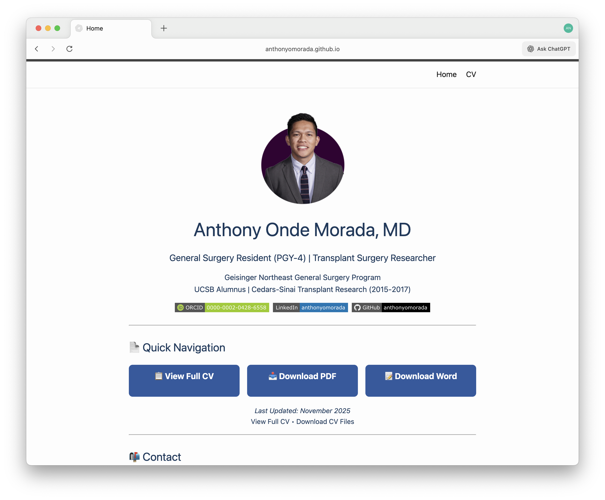

# Academic Medicine Portfolio Template

[](https://github.com/anthonyomorada/am-medical-cv-template/generate)
[](LICENSE)
[](https://pages.github.com/)

**Create your professional academic medicine portfolio website in 5 minutes. Zero coding required.**

A ready-to-use template for medical residents, fellows, and faculty to showcase their CV, publications, and research online. Built for **GitHub Pages** with free hosting and automatic updates.

📺 **[Live Demo](https://anthonyomorada.github.io/anthony-morada-cv/)** | 📖 **[Quick Start Guide](#-quick-start)**



---

## ✨ What You Get

- 🌐 **Professional academic website** - Polished portfolio that updates instantly
- 📱 **Mobile-optimized design** - Looks perfect when program directors view on phones
- 📝 **Markdown editing only** - Edit like a Word doc, no coding needed
- 🆓 **Free hosting forever** - GitHub Pages hosts your site at no cost
- ⚡ **Live in 5 minutes** - From template to published site in one sitting
- 📄 **Auto-generated PDFs** - Download links for Word and PDF versions
- 🔍 **Google searchable** - Your name appears in search results with your site

---

## 🎯 Perfect For

✅ **Residency applications** - Professional portfolio for ERAS supplements
✅ **Fellowship applications** - Showcase research and clinical experience  
✅ **Academic job searches** - Faculty position applications
✅ **Grant applications** - Professional online presence for NIH biosketches
✅ **Networking** - Share your work at conferences and with collaborators

---

## 🚀 Quick Start

### Step 1: Create Your Copy (1 minute)

Click the green **"Use this template"** button at the top of this page.

1. **Repository name**: Choose `[your-name]-cv` (e.g., `jsmith-cv`)
2. **Visibility**: Select **Public** (required for free GitHub Pages)
3. Click **Create repository from template**

✅ **Done!** You now have your own copy.

---

### Step 2: Enable Your Website (1 minute)

In your new repository:

1. Click **⚙️ Settings** (top menu)
2. Click **Pages** (left sidebar)
3. Under "Source":
   - Branch: Select **`main`**
   - Folder: Keep as **`/ (root)`**
4. Click **Save**

Wait 1-2 minutes, then refresh. You'll see:
> ✅ **Your site is live at `https://[your-username].github.io/[repo-name]/`**

---

### Step 3: Add Your Information (3 minutes)

**Edit your homepage:**

1. Click `index.md` in your repository
2. Click the **✏️ pencil icon** (top right) to edit
3. Replace placeholder text with your info:
   - Your name, position, institution
   - Contact information
   - Research summary
   - Stats and highlights
4. Scroll down → **Commit changes** (green button)

**Edit your full CV:**

1. Click `cv.md` in your repository
2. Click the **✏️ pencil icon** to edit
3. Replace with your complete CV
4. **Commit changes**

⏱️ **Wait ~1 minute** → Your site updates automatically!

---

## 📝 What to Edit (Markdown Files Only)

You only need to edit **2 files** - both are plain text (Markdown):

### 1. `index.md` - Your Homepage
- Professional photo
- Contact information  
- Research highlights
- Featured publications
- Awards summary

### 2. `cv.md` - Complete CV
- Education
- Research experience
- Publications (all)
- Presentations
- Awards and honors
- Professional activities

### 3. `_config.yml` - Site Settings (Optional)
```yaml
title: Your Name, MD
email: your.email@institution.edu
description: "General Surgery Resident | Clinical Outcomes Researcher"
```

---

## 🎨 Customization Guide

### Add Your Professional Photo

1. Go to `assets/` folder
2. Click **Add file** → **Upload files**
3. Upload your headshot as `profile-photo.png` (or `.jpg`)
4. Recommended: 400×400px square, professional attire

### Change Theme Color

Edit `assets/style.css` (line 3):
```css
--primary-color: #2c5aa0;  /* Change this hex code */
```

**Popular academic colors:**
- `#2c5aa0` - Professional Blue (default)
- `#1a472a` - Medical Green  
- `#8b0000` - Academic Crimson
- `#003366` - Navy Blue

### Add Publication PDFs

1. Upload PDFs to `publications/` folder
2. In `cv.md`, add links:
```markdown
[[PDF](./publications/2023-smith-outcomes.pdf)]
```

---

## 📱 Mobile Optimization

**This template is designed for program directors viewing on phones** - the most common use case for fellowship/residency applications.

- ✅ Responsive layout adapts to any screen size
- ✅ Touch-friendly navigation buttons  
- ✅ Optimized font sizes for mobile reading
- ✅ Fast loading on cellular connections

---

## 📚 Markdown Quick Reference

**You don't need to know coding** - Markdown is simple text formatting:
```markdown
# Large Heading
## Medium Heading  
### Small Heading

**Bold text**
*Italic text*

- Bullet point
- Another point

[Link text](https://example.com)
```

**[Full Markdown Guide](https://www.markdownguide.org/basic-syntax/)**

---

## 🔧 Troubleshooting

### "My site isn't showing up"
- Wait 2-3 minutes after enabling Pages
- Ensure repository is **Public** (not Private)
- Check Settings → Pages shows green checkmark

### "My changes aren't appearing"
- Wait ~1 minute for GitHub to rebuild your site
- Hard refresh: `Ctrl+Shift+R` (Windows) or `Cmd+Shift+R` (Mac)
- Check you clicked "Commit changes" after editing

### "Images aren't loading"
- File names are case-sensitive: `Photo.png` ≠ `photo.png`
- Check file path matches exactly
- Use forward slashes: `/` not backslashes `\`

### "I see someone else's information"
- You're viewing the **template** - create your own copy with "Use this template"
- Make sure you're editing **your** repository, not the template

---

## 💡 Pro Tips

1. **Update regularly** - Set a calendar reminder to update your CV quarterly
2. **Link everywhere** - Add your site URL to:
   - Email signature
   - LinkedIn profile
   - ERAS application  
   - Conference name badges
3. **Download PDFs** - Many programs want downloadable CVs (we auto-generate these)
4. **Custom domain** (advanced) - Buy `yourname.com` and point it to your GitHub Pages site
5. **Track visitors** (optional) - Add Google Analytics to see who's viewing your CV

---

## 📊 Example Sites Using This Template

Want to see it in action? Here are real academic medicine portfolios built with this template:

- **[Anthony Morada, MD](https://anthonyomorada.github.io/anthony-morada-cv/)** - General Surgery Resident, Transplant Surgery Research

*Using this template? [Submit your site](https://github.com/anthonyomorada/am-medical-cv-template/discussions) to be featured!*

---

## 🆘 Get Help

- 💬 **[Ask Questions](https://github.com/anthonyomorada/am-medical-cv-template/discussions)** - Community support forum
- 🐛 **[Report Issues](https://github.com/anthonyomorada/am-medical-cv-template/issues)** - Found a bug? Let us know
- 📖 **[Full Documentation](https://anthonyomorada.github.io/anthony-morada-cv/)** - See working example with all features

---

## 🌟 Why This Template?

Created by a medical resident who understands what program directors want:

- **Clean, scannable design** - PDs spend 30 seconds per application
- **Mobile-first** - Most PDs review applications on phones between cases
- **Professional credibility** - Custom domain looks better than a Word doc attachment
- **Easy maintenance** - Update once, live everywhere (no re-uploading PDFs)
- **Cost: $0** - Free hosting, no subscriptions, no catches

---

## 📜 License

**Free to use** under [MIT License](LICENSE). No attribution required (but appreciated!).

You can:
- ✅ Use for personal or commercial purposes
- ✅ Modify and customize freely  
- ✅ Share with colleagues
- ✅ Remove all references to this template

---

## 🙏 Credits

**Created by [Anthony Onde Morada, MD](https://github.com/anthonyomorada)**  
*PGY-4 General Surgery Resident | Transplant Surgery Research*

Built for medical professionals who want a simple, professional online presence without learning web development.

**Technology:**
- [GitHub Pages](https://pages.github.com/) - Free hosting
- [Jekyll](https://jekyllrb.com/) - Static site generator  
- [Minima Theme](https://github.com/jekyll/minima) - Clean design
- Markdown - Simple text formatting

---

## ⭐ Support This Project

If this template helped you:
- ⭐ **Star this repository** to help others find it
- 🔗 **Share with colleagues** applying for fellowships/jobs
- 💬 **[Share feedback](https://github.com/anthonyomorada/am-medical-cv-template/discussions)** on how we can improve

---

**Ready to build your portfolio?** Click **[Use this template](https://github.com/anthonyomorada/am-medical-cv-template/generate)** to get started! 🚀
```

---

## 2️⃣ **Repository Description** (GitHub Settings)
```
Professional CV website template for medical residents, fellows, and faculty. Deploy your academic portfolio in 5 minutes with GitHub Pages. No coding required - edit with Markdown only.
```

---

## 3️⃣ **Repository Topics** (GitHub Settings → About)
```
medical-cv
academic-medicine
github-pages
jekyll-template
residency-application
fellowship-application
medical-portfolio
academic-cv
markdown-cv
medical-education
cv-template
portfolio-template
physician-cv
medical-resident